# Habit Tracker in Python:
This habit tracker uses object-oriented programming (OOP) and functional programming. It is created for project-based-learning course for <b>IU International University of Applied Sciences</b>.

## Habit Tracker: What is it?
A habit tracker is a recorder that helps you to keep a track of your habits. It provides a functionality to create new habits, mark a habit complete, analyze all the habits and delete the existing habits.

## Python CLI Habit Tracker
A command-line interface (CLI) Habit Tracker built in Python to help you create, track, and analyze your daily or weekly habits. This tool stores habits persistently using SQLite and provides streak tracking to motivate consistency.

## Key Features
- Add new habits with descriptions and select daily or weekly duration
- Mark habits as completed for the current day or week
- View all habits with current streaks and last completion dates
- Analyze habit logs including longest streaks and check-off records
- Delete habits when no longer needed
- Data persistence with built-in SQLite database `habit.db`
- Intuitive menu-driven CLI interface powered by questionary for user prompts
- Clean and colored output for better readability using Rich library

## Installation

1. Clone the repository:
```bash
https://github.com/masoombano-shaikh/Python-CLI-Habit-Tracker.git
```

2. (Optional) Create a virtual environment and activate it:
- For macOS:
```bash
# for macOS
python3 -m venv venv
source venv/bin/activate

#for windows
python -m venv venv
.\venv\Scripts\activate
```

3. Dependencies

- Python 3.x
- `sqlite3` (builtin)
- `questionary` for CLI prompts
- `rich` for colored console output
- `freezegun` for testing current date and time for consistent results
- Install required dependencies:
```bash
pip install -r requirements.txt
```
#### OR
- Install dependencies manually via prompt:
```bash
pip install rich questionary freezegun
```
## Database

- Uses SQLite `habit.db`
- Two main tables:
  - `habit` stores habit metadata (name, description, duration, creation date, streak)
  - `progress` stores daily or weekly marks of completion for habits to calculate streaks

## Usage


- Note: When the command is executed, main menu shows-up on the screen. To view the pre-loaded habits:<br>
Main Menu > 3.Analyse > 1. Analyse all habits.

### Main Menu Options

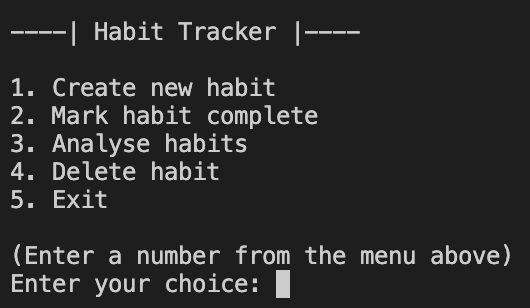<br>
- **Add a Habit**: Enter a habit name, description, and choose if it's daily or weekly.<br>
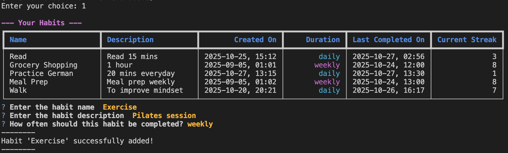<br>
- **Mark Habit Complete**: Mark selected habit as done for today/week, updates streak automatically.<br>
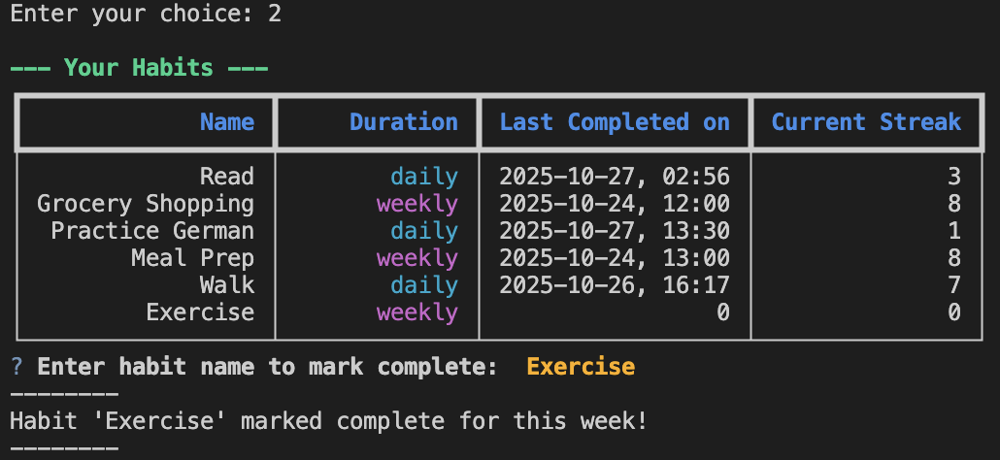<br>
- **Analyze Habits**:<br>
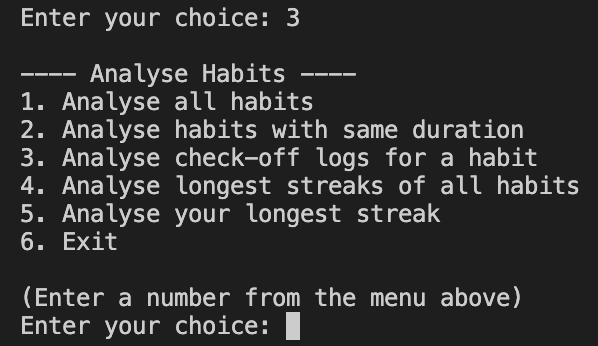<br>
  - Analyze all habits:<br>
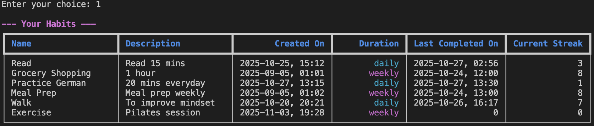<br>
  - Analyze habits by duration (daily/weekly).<br>
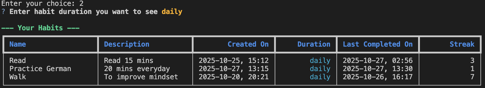<br>
  - View check-off logs for individual habits.<br>
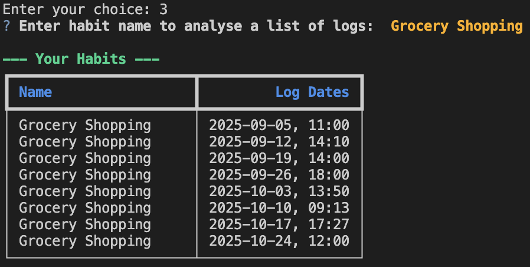<br>
  - Review longest streaks of all habits.<br>
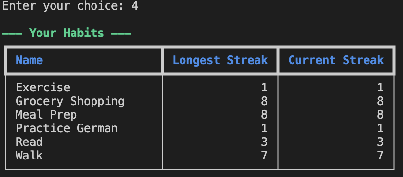<br>
  - Review longest streaks among all habits.<br>
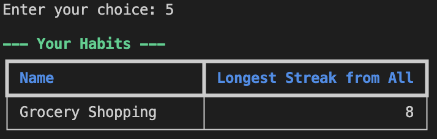<br>
- **Delete Habit**: Remove a habit from the database.<br>
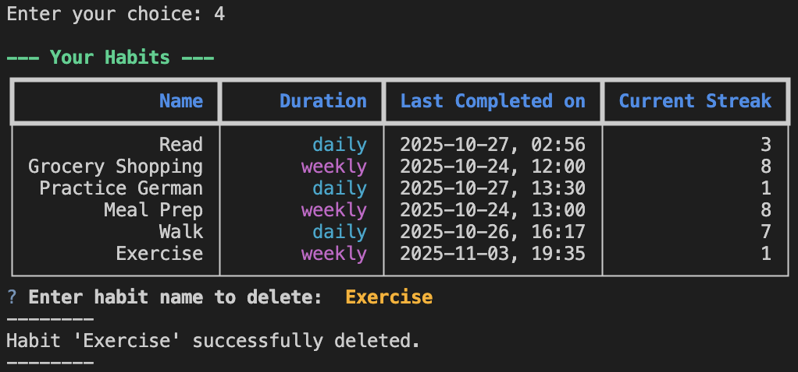<br>
- **Exit**:
  -  Displays a choice for exiting the tracker, if selected 'No', it returns back to the program.<br>
 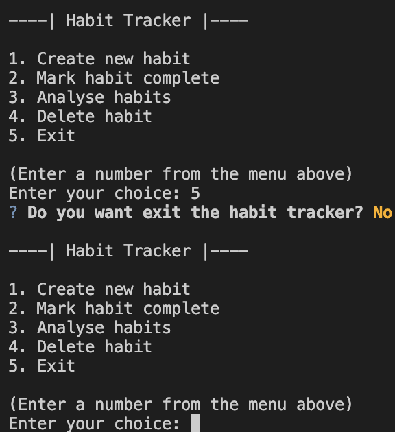<br>
  -  If selected 'Yes', it exits the program.<br>
   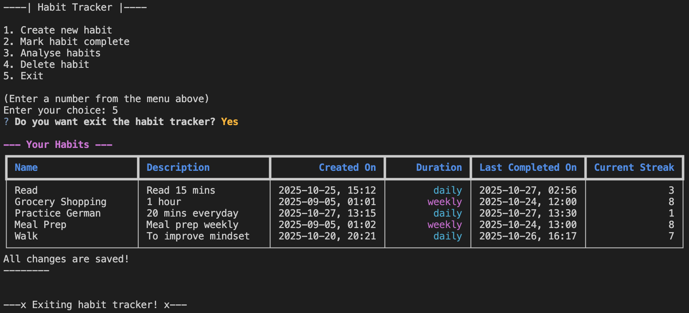<br>


## Testing

To execute the test suite:
```bash
pytest
```

## Development and Contributions:
Built with Python and designed with a easy architecture for future scalability that can track progress from the terminal.

---# Python-CLI-Habit-Tracker
